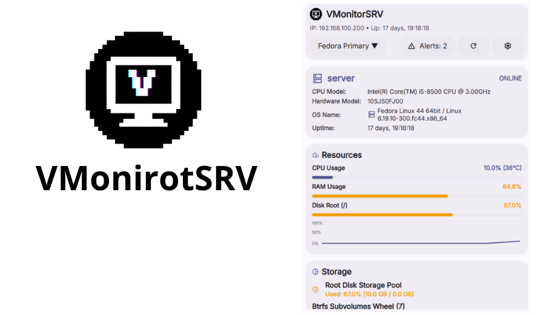

# fedsrv-control

[](https://github.com/AvengeMedia/DankMaterialShell)
[](LICENSE)

<p align="center">
  
</p>

**fedsrv-control** is a native *Composite Plugin* for **DankMaterialShell (DMS ≥ 1.5.0)** built to provide real-time monitoring and management of a Fedora Linux server directly from your desktop environment.

---

<p align="center">
  
</p>

## Overview & Features

Designed with modularity in mind, `fedsrv-control` splits its interface across multiple surface types provided by DMS 1.5, allowing you to track system health without cluttering your workspace:

* **DankBar Widget (`widget`):** A minimal indicator for the top bar (supporting both horizontal and vertical orientation). Displays current CPU and RAM load alongside an LED status icon that reflects overall server availability and alerts.
* **Detailed Control Panel (`popout`):** Clicking the bar widget reveals a rich control center with comprehensive telemetry:
  * **Host & Hardware Details:** Hostname, CPU model, OS version, kernel build, and uptime.
  * **Live Resources:** Custom styled progress bars for CPU, RAM, and root storage.
  * **Btrfs Subvolumes:** Monitored usage across active subvolume mounts.
  * **Podman Containers:** Live status tracking for active/stopped/error containers, image tags, and memory usage.
* **Desktop Layer Tile (`desktop`):** An independent widget anchored directly to the desktop layer via *wlr-layer-shell* for continuous background monitoring.

---

## Performance & Architecture

Built for minimal overhead, `fedsrv-control` maintains less than **1% CPU utilization** on the client side. 

* **Asynchronous Polling:** Leverages native `XMLHttpRequest` calls in QML to query the server API asynchronously without spawning heavy external sub-processes.
* **Tiered Updates:** Uses high-frequency fast-polling (1.5s) for critical live metrics (CPU/RAM) and low-frequency slow-polling (15s) for static metadata (hardware info, mounts).
* **Fault Tolerant:** Automatically switches to a graceful "OFFLINE" state with a visual fallback banner if the server endpoint drops or becomes unreachable, preventing desktop UI freezes.

---

## Server Requirements & Glances Integration

The plugin connects to a custom Glances monitoring setup on the remote server.

### Prerequisites
1. **DankMaterialShell** version `1.5.0` or higher.
2. A remote server running **Glances** configured with the tailored dotfiles repository:
   * 🔗 **Glances Dotfiles:** [sowtarez / dotfiles-glances](https://gitlab.com/sowtarez/dotfiles-glances)
   *(Note: An automated `install.sh` script and `systemd` service setup will be added to the dotfiles repository soon).*

---

## Installation & Setup

1. **Clone or move the plugin** into your DMS plugins directory:
   ```bash
   git clone https://github.com/your-username/fedsrv-control.git ~/.config/DankMaterialShell/plugins/fedsrv-control
   ```

2. **Scan and Reload Plugins:**
   Open DMS Settings → Plugins → Scan for Plugins, enable `fedsrv-control`, and run:
   ```bash
   dms ipc call plugins reload fedsrv-control
   ```

3. **Configuration:**
   Open Settings → Plugins → fedsrv-control Settings to set your server's API Host/Port and adjust polling frequencies.
